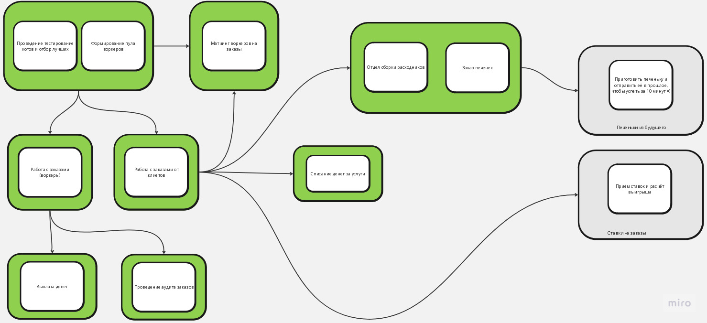
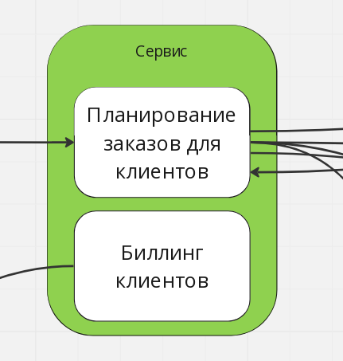
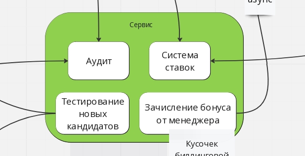
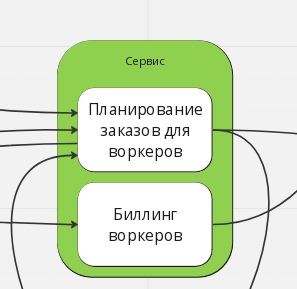
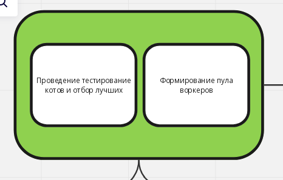
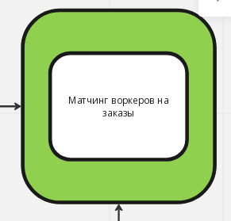
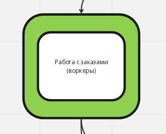
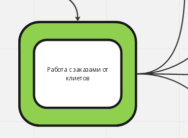
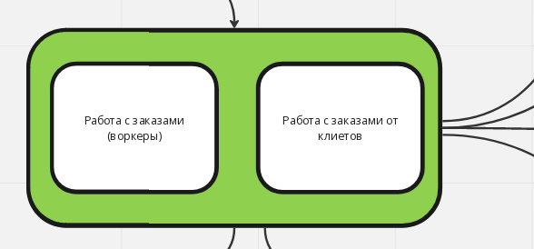

# Вводная

Я буду работать с тем, что накидал в 0 ДЗ.

Его можно найти по ссылке: https://github.com/dmmarkov/make-cats-free-again/tree/main/week-0

*Off-topic*: Мне самому тяжело читать то, что я рисовал, потому что тут в целом есть какой-то концепт, но его тяжело понять =)

Я чуть преобразую то что в 0 домашке к виду который более-менее привычен: https://miro.com/app/board/uXjVMB5td18=/?share_link_id=81244204331

Работа будет происходить в условиях: **нет людей**

В моей жизни самое частое - это отсутствие ресурсов на то, чтобы что-то нормально делать, поэтому для интереса предположу, что у меня нет квалифицированных людей.

*У нас было 10 джунов и 1 сеньор, не то чтобы это необходимый минимум, чтобы сделать какой-то нормальный проект, но чёрт возьми, я знал что рано или поздно мы вляпаемся и в ЭТО!!!*

# Схема из 3 ДЗ

# Разница между двумя системами
Аудит, Ставки, Тестирование новых кандидатов, а также зачисление бонуса от менеджера попало в один сервис.

Это у меня получается, что только сервис отвечающий за сбор расходников нормальным вышел в 0 ДЗ =) *Лол-Кек-Чебурек* =)

*Котострофа не иначе =)*

# Считаем instability для сервисов 0 домашки

	Instability = 6 / (6+2) = 0.75 ʕノ•ᴥ•ʔノ ︵ ┻━┻

	Instability = 3 / (3 + 4) = 0.42 (ò_ô)

	Instability = 4 / (4 + 4) = 0.5 (¯\_(ツ)_/¯)

# Считаем instability для сервисов 3 домашки

	Instability = 3 / (3 + 0) = 1 (┬──┬ ノ(ò_óノ))

	Instability = 0 / (0 + 2) = 0 (❤)

	Instability = 2 / (2 + 1) = 0.6 (╥﹏╥)

	Instability = 4 / (4 + 1) = 0.8 (╥﹏╥)

А если бы я не расстаскивал работу с заказами и она была бы в одном сервисе, то instability был бы таким (*чистая фантазия для самого себя*)

	Instability = 6 / (6 + 1) = 0.85 (╥﹏╥)

# Что будет меняться
Самая большая проблема - это мега сервис в котором по соседству живёт аудит, ставки тестирование новых кандидатов и технический шаг биллинга.

Это смешались разные контексты в пределах одного сервиса, к которым предъявляются разные требования. Поэтому будем разделять его на кусочки, а кусочек биллинга поедет в биллинг.

В предыдущем ДЗ я отделял сервисы биллингов, потому что это финансовые сервисы к которым есть строгие требования. Поэтому их нужно будет вынести в отдельные сервисы.

*На всякий случай. В 0 домашке я все связи сделал асинхронными. Ну вот так решил чутка упороться в Event-Driven (⌐ ͡■ ͜ʖ ͡■) Допускаю, что без изменений вида связи всё будет работать, поэтому механизм взаимодействия сервисов sync/async я оставлю за скобками (✿◠‿◠)*

# Планирование работ

1. **Зачисление бонуса от менеджера** несём в биллинг воркеров, т.к. это технический шаг биллинга воркеров. В плане реализации - я бы сначала добавил код по зачислению бонуса в биллинг воркеров, а потом уже удалял бы код из мега-сервиса. По сути это наполовину сделанный Change Data Capture, потому что ивенты уже генерируются в одном сервисе и приходят в другой, а в билинге просто нужно сделать "кнопку" и потом почистить код в мега-сервисе, чтобы он ничего не генерировал.
2. Следующим не критичным сервисом будет **система ставок**. Хотя менеджеры наверное грустить будут без тотализатора, но в случае прям серьёзного факапа можно подогнать им настойку кошачьей мяты, чтобы сгладить негатив =) Действовать предлагаю по схеме Change Data Capture. В целом сервис не критичный, но т.к. опыта мало, то будет проще выкатить пустой сервис, а потом уже на него накрутить функционал и отдать его менеджерам.
3. Пора браться за что-то посложнее. И это будет **Аудит**. Всё как и в предыдущих 2х разах: беру принцип Change Data Capture, потому что у меня как бы полный EDA. На третий раз уже будет +- какая-то экспертиза.
4. Следующее, что я предложил бы сделать - это вынести *биллинг по списанию денег с клиентов*. Тут подойдёт вариант Strangler Fig Application, т.к. в целом была идея, что это должен быть Microkernel, чтобы можно было добавлять разные варианты списания денег. В целом если тут накосячить, то есть старый биллинг, а также в целом если у клиента не спишутся деньги, то это как бы потери компании (это плохо, но потери отложенные, так что бизнес я думаю, что согласится), а клиенты сильно не расстроятся, что деньги у них спишутся попозже.
5. Последнее - это *биллинг по оплате работы воркеров*. Штука важная. Я бы здесь применил Tactical Forking, потому что менять ничего не надо, а надо просто перенести чтобы работало. Хотя если честно, то в реальном мире я бы эту задачу отложил как тех.долг, если всё будет работать и не будет мешаться.

# Мои выводы
Очень интересно было открыть 0 ДЗ и понять, что там ничего не понятно, хотя есть куча лишних деталей, поэтому пришлось порисовать.

Очень интересно получилось в конце узнать, что у меня смешались кони-люди в одном мега-сервисе (☞ﾟ∀ﾟ)☞

